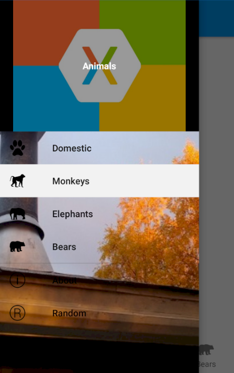
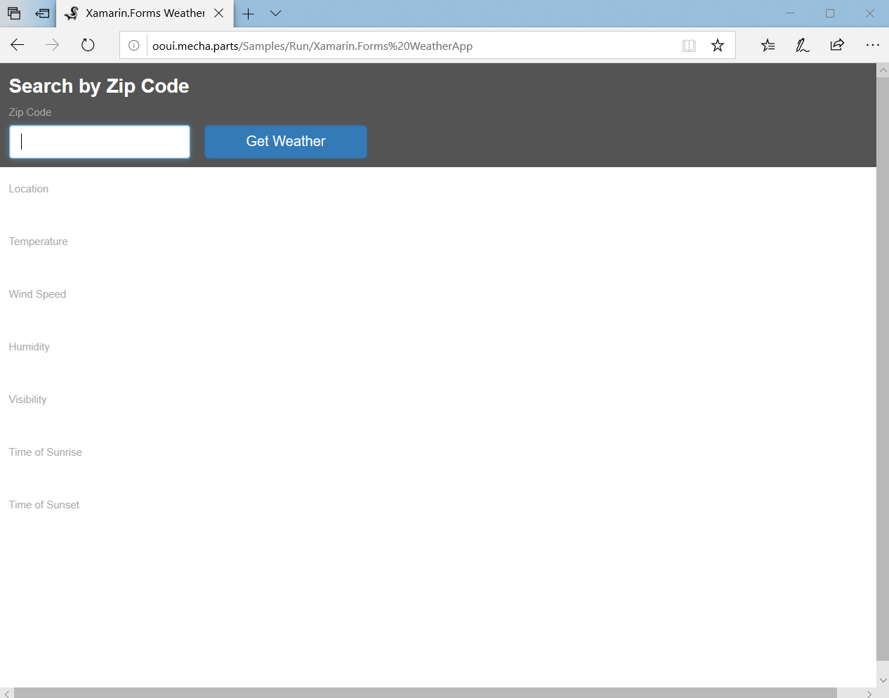
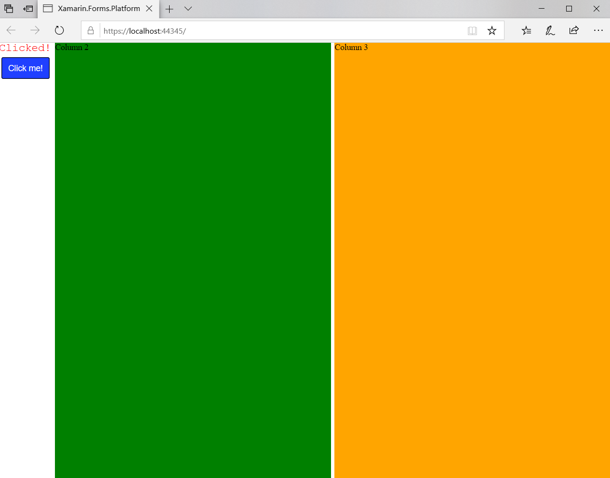
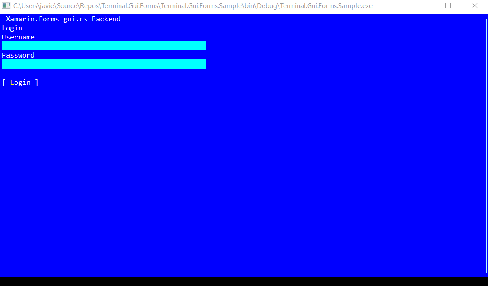

# Xamarin.Forms Backends 

A curated list of **community** Xamarin.Forms backends.

## [MobileBlazorBindings](https://github.com/xamarin/MobileBlazorBindings)

Mobile Blazor Bindings enable developers to build native mobile apps using C# and .NET for iOS and Android using familiar web programming patterns. This means you can use the Blazor programming model and Razor syntax to define UI components and behaviors of an application. The UI components that are included are based on Xamarin.Forms native UI controls, which results in beautiful native mobile apps.

  

## [Ooui](https://github.com/praeclarum/Ooui)

Ooui (pronounced weee!) is a small cross-platform UI library for .NET that uses web technologies. Include a WebAssembly mode of Ooui running Xamarin.Forms.

Head on over to http://ooui.mecha.parts to try out the samples. 

## [Xamarin.Forms.Platforms.Blazor](https://github.com/legistek/Xamarin.Forms.Platforms.Blazor)

A proof of concept for a Blazor backend render platform for Xamarin.Forms.

## [Xamarin.Forms.Unity](https://github.com/aosoft/Xamarin.Forms.Unity)

Xamarin.Forms for Unity (Platform implementation for Unity Game Engine).

## [Xamarin.Forms.WinForms](https://github.com/aosoft/Xamarin.Forms.WinForms)

Xamarin.Forms for Windows Forms (Platform implementation).

## [xamarin-forms-gui.cs](https://github.com/jsuarezruiz/xamarin-forms-gui.cs)

[gui.cs](https://github.com/migueldeicaza/gui.cs) is a simple UI toolkit for .NET, .NET Core and Mono and works on both Windows and Linux/Unix created by [Miguel de Icaza](https://github.com/migueldeicaza).

This project is a small Xamarin.Forms backend of gui.cs. Yes, create **console** Apps with C# and XAML!.

